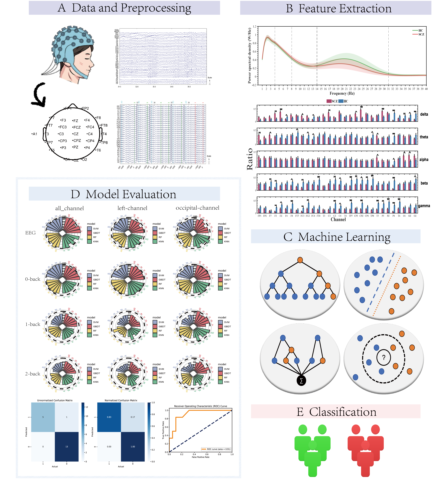
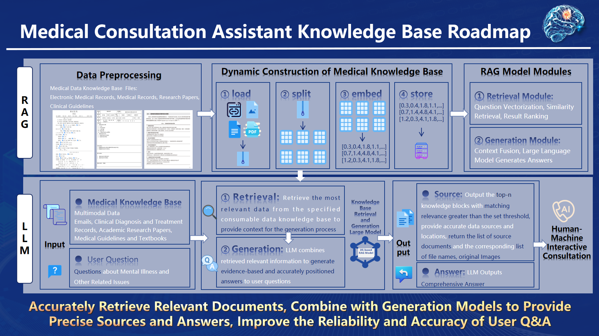
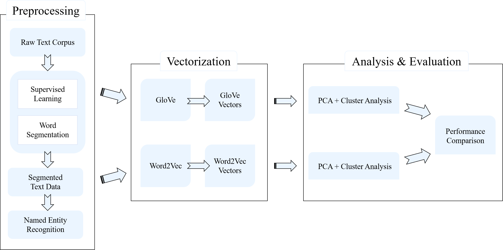
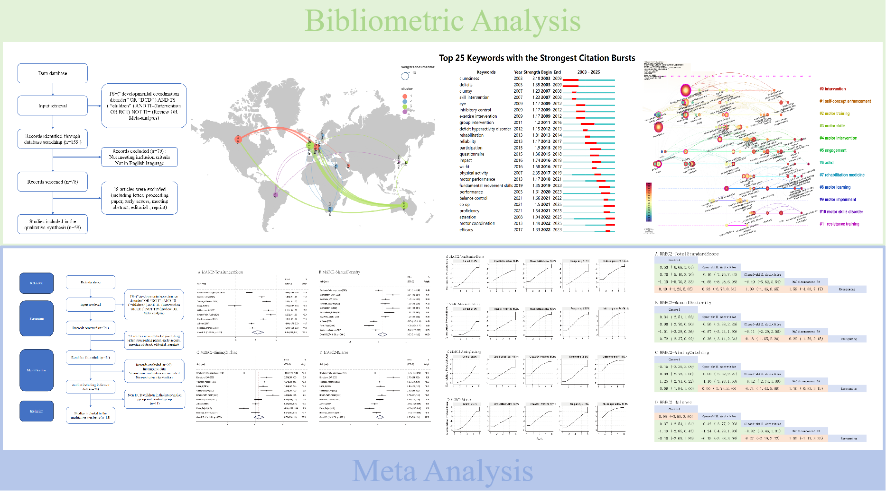

# 📝 Research Experience 

  

    <!-- 在此 div 上添加内联样式控制对齐 -->
    

      
Decoding Schizophrenia with EEG & ERP

**Decoding Schizophrenia: Superior Discriminative Power of Resting-State EEG over Event-related Potentials in a Comparative Machine Learning Framework**

This work establishes that for machine learning-based diagnosis, resting-state EEG provides a more powerful and reliable basis for classifying schizophrenia than brain activity recorded during cognitive tasks (ERPs).

  
Content

  

<ul>
  <li>
    
<strong>EEG/ERP Data Preprocessing</strong>: Systematically processed resting-state EEG and N-back task ERP signals using EEGLAB, implementing a full pipeline of filtering, artifact rejection, and normalization to maximize signal integrity and ensure high-quality data for analysis.

  </li>
  <li>
    
<strong>Frequency-Domain Biomarker Identification</strong>: Employed Fourier Transform to extract power and energy spectrum features, converting complex time-series data into a clear frequency-domain representation to uncover potential biomarkers of schizophrenia.

  </li>
  <li>
    
<strong>Interpretable Machine Learning for Diagnosis</strong>: Developed diagnostic models using interpretable algorithms (SVM, GBDT, KNN, Random Forest). Leveraged the Fisher-score algorithm for feature selection to pinpoint the most discriminative neural patterns across different frequency bands and brain regions.

  </li>
  <li>
    
<strong>Key Findings</strong>: Demonstrated that GBDT model achieved superior performance in classifying resting-state EEG, while SVM was optimal for task-based ERP data. This highlights a state-dependent optimal model choice. Identified the occipital lobe during visual processing tasks as a critical region containing highly discriminative features, suggesting its key role in the pathophysiology of schizophrenia.

  </li>
</ul>
    
  

 
  <!-- 在此 div 上添加内联样式控制对齐 -->
    

      
Decoding Age-Related Schizophrenia

**Age-Related Neural Signatures of Schizophrenia: A Cross-Cohort Deep Learning Analysis of EEG Functional Connectivity**

This research investigates age-related neural signatures of schizophrenia by conducting a comparative analysis of adult and adolescent EEG data, leveraging advanced brain network modeling and deep learning.

  
Content

  

<ul>
  <li>
    
<strong>Cross-Cohort & Cross-Age Comparative Framework</strong>: Initiated a novel comparative study between a privately collected adult schizophrenia EEG dataset (Shanghai) and a public adolescent dataset (Moscow), establishing a framework to test the generalizability of neural biomarkers across different age groups and populations.

  </li>
  <li>
    
<strong>Functional Brain Network Construction & Analysis</strong>: Constructed functional brain networks using Power Spectral Density (PSD) as node features and Phase Lag Index (PLI) / Phase Locking Value (PLV) as edge weights. This approach enabled a direct comparison of functional connectivity patterns between the two distinct patient cohorts.

  </li>
  <li>
    
<strong>Graph-Based Deep Learning for Neuropathology</strong>: Applied Graph Convolutional Network to model the brain's functional connectome, successfully identifying complex, non-linear neuropathological patterns that distinguish the adult and adolescent schizophrenia cohorts.

  </li>
  <li>
    
<strong>Developing a Superior Hybrid Diagnostic Model</strong>: Designed and benchmarked multiple deep learning architectures for diagnostic classification. The proposed LSTM-Transformer model demonstrated superior performance and robustness, outperforming other hybrid models across both datasets, providing a powerful solution for cross-cohort diagnosis.

  </li>
</ul>
  
  
  

  

    <!-- 在此 div 上添加内联样式控制对齐 -->
    

      
AI-Assisted Clinical Diagnosis
      

      
      
      <video src='../../images/网页展示视频.mp4' alt="video" width="60%" controls preload="metadata">
        Your browser does not support video playback. 
        您的浏览器不支持视频播放。
      </video>
    

  

**An Interactive Platform for AI-Assisted Clinical Diagnosis**

This website demonstrates the translation of foundational AI research into a tangible clinical tool. I independently conceived and developed an interactive web-based platform designed to bridge the gap between computational models and real-world clinical practice.

  
Content

  

<ul>
  <li>
      
<strong>A Holistic, LLM-Enhanced Diagnostic Framework</strong>: Drawing on my industry experience with Large Language Models (LLMs), I engineered a novel platform that integrates three critical data sources: objective EEG-based diagnostic predictions, standardized clinical assessment scales, and a dynamic, interactive patient consultation module.

    </li>
    <li>
      
<strong>Rapid Prototyping and Research-to-Practice Translation</strong>: I demonstrated strong self-learning and execution capabilities by mastering the Streamlit framework from the ground up to build and deploy a functional prototype in just two weeks. This platform is specifically designed to create a seamless workflow between computational research and hands-on clinical assessment.

    </li>
    <li>
      
<strong>Domain-Specific Language Model Customization</strong>: To power the platform’s consultation module, I built a specialized, lightweight language model. By leveraging Retrieval-Augmented Generation (RAG), the model was fine-tuned on a curated corpus of medical literature and clinical reports to provide context-aware and evidence-based responses for clinical inquiries.

    </li>
</ul>
    
  

   <!-- 在此 div 上添加内联样式控制对齐 -->
    

      
Word Vector Models

**Uncovering Semantic Structures in Stroke Research: A Comparative Analysis of Word Vector Models**

This project leverages natural language processing and unsupervised learning to systematically analyze a large corpus of medical literature, providing a data-driven evaluation of word embedding techniques for a specialized domain.

  
Content

  

<ul>
  <li>
    
<strong>Domain-Specific Text Processing Pipeline</strong>: Engineered a specialized text processing pipeline to handle the unique challenges of medical literature. By training a word segmentation model on manually annotated samples, the system achieves high accuracy in identifying professional medical terms within a large-scale corpus of stroke research abstracts.

  </li>
  <li>
    
<strong>Head-to-Head Comparison of Word Embedding Models</strong>: Conducted a direct comparative analysis of two seminal word embedding algorithms, GloVe and Word2Vec. Both models were trained on the processed corpus to create distinct vector-space representations of the stroke research domain, allowing for a rigorous evaluation of their ability to capture semantic relationships.

  </li>
  <li>
    
<strong>Quantitative and Qualitative Performance Evaluation</strong>:Employed unsupervised learning (cluster analysis) as a downstream task to provide an evidence-based evaluation of each vectorization model. By comparing the quality of the resulting thematic clusters, this work offers a clear conclusion on which algorithm is superior for uncovering meaningful, latent structures within specialized scientific literature.

  </li>
</ul>
  
  

  <!-- 在此 div 上添加内联样式控制对齐 -->
    

Interventions for DCD

**Interventions for Developmental Coordination Disorder (DCD)**

This study provides a comprehensive analysis of the research landscape for interventions targeting DCD in children, combining a wide-ranging bibliometric review with a detailed meta-analysis of intervention effectiveness.

  
Content

  

<ul>
  <li>
    
<strong>Systematic Mapping of the Global Research Landscape</strong>: Conducted a large-scale bibliometric analysis to identify key research trends, geographical patterns, and influential institutions and authors in the field of DCD intervention. The study highlights Canada, particularly McMaster University, as a central hub for DCD research.

  </li>
  <li>
    
<strong>Evidence-based Evaluation of Intervention Efficacy</strong>: Performed a meta-analysis to quantitatively assess the effectiveness of various motor interventions using the standardized Movement Assessment Battery for Children-2 (MABC-2).

  </li>
  <li>
    
<strong>Identification of Optimal Intervention Strategies</strong>: The findings demonstrate that different interventions yield distinct benefits. Notably, multi-component exercises are most effective for improving balance, while task-oriented and skill-based activities show significant advantages for enhancing manual dexterity, aiming, and catching.

  </li>
  <li>
    
<strong>Guidance for Future Clinical Practice and Research</strong>: By integrating bibliometric trends with quantitative efficacy data, this research identifies critical gaps in the literature and proposes a clear, data-driven framework for designing and implementing targeted DCD management strategies.

  </li>
</ul>
  
  

  <!-- 在此 div 上添加内联样式控制对齐 -->
    

  
EEG-Based Fatigue Prediction

  
  <video src='../../images/Pleisure疲立测作品设计材料.mp4' alt="video" width="60%" controls preload="metadata"></video>

**"PLEISURE" - An On-Chip, Real-Time System for EEG-Based Fatigue Prediction**

This work encompasses the end-to-end development of an intelligent IoT system for real-time fatigue prediction, from algorithm design and on-chip hardware implementation to advanced deep learning analysis.

  
Content

  

    
<ul>
  <li>
    
<strong>FPGA-Based Real-Time Algorithm Implementation</strong>: A fatigue detection algorithm was designed and implemented on an FPGA. This on-chip processing enables real-time signal analysis at the edge for a wearable predictive warning system.

  </li>
  <li>
    
<strong>Non-Linear Feature Engineering</strong>: A feature extraction pipeline was developed to quantify fatigue from raw EEG signals. The process involves computing non-linear dynamic metrics, including Sample Entropy and Approximate Entropy, to characterize changes in brain activity associated with physiological fatigue.

  </li>
  <li>
    
<strong>Dual-Approach Deep Learning for Classification</strong>: Two deep learning models were architected and benchmarked for fatigue classification. A CNN-LSTM fusion model was applied to capture spatio-temporal dependencies in EEG signals, while GNN was used to model the brain's functional connectivity.

  </li>
</ul>

  

